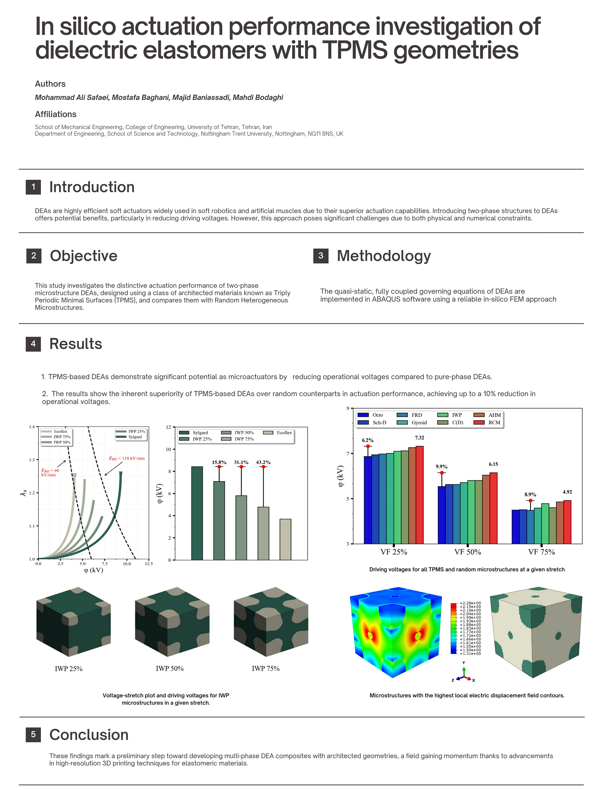

<p>This repository contains the cores related to the research article titled <a href="https://doi.org/10.1016/j.euromechsol.2024.105540"><b>In silico actuation performance investigation of dielectric elastomers with TPMS geometries</b></a>,which is published at <i>European Journal of Mechanics - A/Solids.</i> 
The picture below denotes a brief insight to this work




In the following, the details about this project is denoted. Also, the codes explanation and the way the are run is provided.

Part of the code for creating TPMS structures was developed by:<br/>
- **Fayyaz Nosouhi**: [email](dehnavifn@gmail.com), **Saeed Khaleghi**: [email](saeedkhaleghi123@gmail.com) </br>

The remaining parts of the code, including the definition of DEA composites and their implementation in ABAQUS, were developed by:
- <b>Mohammad Ali Safaei</b>: <a href= "mohammadsf1998@gmail.com"><b>Email address</b></a>, <a href= "https://scholar.google.com/citations?user=jD_-4JcAAAAJ&hl=fa"><b>Google Scholar</b></a>, 
<a href= "https://www.linkedin.com/in/mohsafaei"><b>Linkedin</b></a>.</br>  

This Python script requires the use of a UEL subroutine, which implements the constitutive equations for a DEA element. In this regard, the UEL subroutine developed by Ehsan Hajiesmaili was utilized.    
The UEL file and is available in the supplementary material of the following research article: [Link](https://pubs.aip.org/aip/jap/article/129/15/151102/1025587/Dielectric-elastomer-actuators)  
This project was done at **University of Tehran, December 2024**

Co-authors of the article contains:

## contribution statement
- Mohammad Ali Safaei: Writing: original draft, Validation, Software, Methodology, Investigation, Formal analysis, Conceptualization.
- [Mostafa Baghani](https://scholar.google.com/citations?user=hbptgRoAAAAJ&hl=en): Writing – review & editing, Supervision, Methodology, Investigation, Formal analysis. 
- [Majid Baniassadi](https://scholar.google.com/citations?user=sVnPip4AAAAJ&hl=en): Writing – review & editing, Supervision, Methodology, Investigation, Formal analysis.
- [Mahdi Bodaghi](https://scholar.google.com/citations?user=Kgjbp-IAAAAJ&hl=en): Writing – review & editing, Supervision, Methodology, Investigation, Formal analysis.

## Steps to Run a Python Script in ABAQUS:

### Within ABAQUS/CAE:

- Open ABAQUS/CAE.
  - Navigate to **File > Run Script.**
  - Browse to your .py file, select it, and click OK to run the script.
- Use the ABAQUS execution command if running the script outside CAE:
```python
 abaqus job=job_name user=subroutine_name script=script_name.py
```

