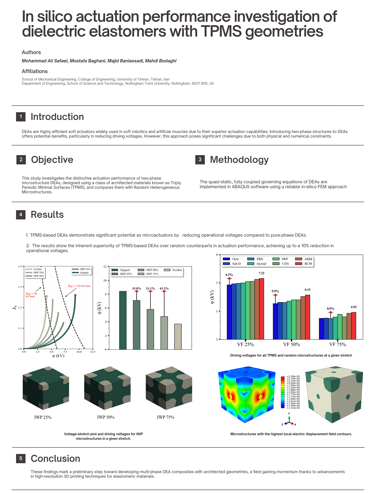

# In Silico Actuation Performance Investigation of Dielectric Elastomers with TPMS Geometries

This repository contains the codes related to the research article titled **[In silico actuation performance investigation of dielectric elastomers with TPMS geometries](https://doi.org/10.1016/j.euromechsol.2024.105540)**, published in the *European Journal of Mechanics - A/Solids.*

## Overview

**Dielectric Elastomer Actuators (DEAs)** are a class of soft actuators that exhibit large deformations when subjected to an electric field. Due to their lightweight nature, high energy density, and fast response time, DEAs have attracted significant attention in fields such as soft robotics, biomedical devices, and adaptive structures.

This research investigates the actuation performance of DEAs with **triply periodic minimal surface (TPMS) geometries**, providing new insights into their electromechanical behavior. The study employs numerical simulations and computational models to analyze how complex microstructures influence the performance of these actuators.

### Visual Insight
The figure below provides a brief visual insight into this study:



---
## Project Information

| **Project Title** | **In Silico Actuation Performance Investigation of Dielectric Elastomers with TPMS Geometries** |
|---|---|
| **Description** | This project explores the actuation performance of DEAs with complex geometries using computational modeling. |
| **Publication** | [Published Paper](https://doi.org/10.1016/j.euromechsol.2024.105540) |
| **Authors** | Mohammad Ali Safaei, [Mostafa Baghani](https://scholar.google.com/citations?user=hbptgRoAAAAJ&hl=en), [Majid Baniassadi](https://scholar.google.com/citations?user=sVnPip4AAAAJ&hl=en), [Mahdi Bodaghi](https://scholar.google.com/citations?user=Kgjbp-IAAAAJ&hl=en) |

This repository includes details about the project, explanations of the provided codes, and instructions on how to run them.

## Acknowledgments
Special thanks to:
- **Fayyaz Nosouhi** ([Email](mailto:dehnavifn@gmail.com))
- **Saeed Khaleghi** ([Email](mailto:saeedkhaleghi123@gmail.com))

The remaining parts of the code, including the implementation of DEA composites in ABAQUS, were developed by:

- **Mohammad Ali Safaei**  
  [Email](mailto:mohammadsf1998@gmail.com) | [Google Scholar](https://scholar.google.com/citations?user=jD_-4JcAAAAJ&hl=fa) | [LinkedIn](https://www.linkedin.com/in/mohsafaei)

## Dependency: UEL Subroutine

This Python script requires a **User Element (UEL) subroutine**, which implements the constitutive equations for a DEA element. The **UEL subroutine developed by Ehsan Hajiesmaili** was used in this project. The UEL file is available in the supplementary material of the following article:

[Dielectric Elastomer Actuators – Constitutive Model](https://pubs.aip.org/aip/jap/article/129/15/151102/1025587/Dielectric-elastomer-actuators)

This research was conducted at **the University of Tehran, December 2024**.

---

## Author Contributions

| Contributor | Role |
|---|---|
| [Mohammad Ali Safaei](https://mohsafaei.github.io/) | Writing: original draft, Validation, Software, Methodology, Investigation, Formal analysis, Conceptualization |
| [Mostafa Baghani](https://scholar.google.com/citations?user=hbptgRoAAAAJ&hl=en) | Writing – review & editing, Supervision, Methodology, Investigation, Formal analysis |
| [Majid Baniassadi](https://scholar.google.com/citations?user=sVnPip4AAAAJ&hl=en) | Writing – review & editing, Supervision, Methodology, Investigation, Formal analysis |
| [Mahdi Bodaghi](https://scholar.google.com/citations?user=Kgjbp-IAAAAJ&hl=en) | Writing – review & editing, Supervision, Methodology, Investigation, Formal analysis |

---

## Running the Python Script in ABAQUS

### **Using ABAQUS/CAE:**
1. Open **ABAQUS/CAE**.
2. Navigate to **File > Run Script**.
3. Browse to your `.py` file, select it, and click OK to run.

### **Running Outside ABAQUS/CAE:**
If running the script externally, use the following command:
```sh
abaqus job=job_name user=subroutine_name script=script_name.py
```
Replace `job_name`, `subroutine_name`, and `script_name.py` with your specific file names.

---

This repository serves as a computational framework for further explorations into the electromechanical performance of **DEAs with complex geometries**. Contributions and discussions are welcome!

